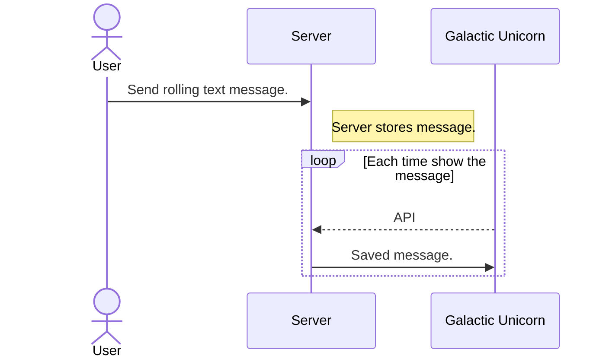

# Rolling Galactic
A text scroller for PIMORONI Galactic Unicorn.
https://shop.pimoroni.com/products/galactic-unicorn

You can control your Galactic Unicorn via the web.

This app is under development, I might add more features whenever I feel like it.

- [x] Support for multiple Galactic Unicorn.
- [ ] Play a sound for new message.
- [ ] Support for fonts(Bitmap Distribution Format)


This application is server-client pair.
You can run this server application on a Raspberry Pi 4 or almost any Python3 environment.



When you run this server on your local network, you can send text to your Galactic Unicorn from anywhere in your home. If you wish to access your Galactic Unicorn from outside of your home(local network), you need to set up the server on public.

I am running this server at https://rolling.kotamorishita.com/ 
Feel free to use this server for *testing purpose*, but please keep in mind followings.
- Not secure at all. Do not send any sensitive information.
- Do not use it for production.
- I might shutdown, modify, reboot or completely stop this server at any time.

## Server setup

The server application is written in Python 3 with Flask.
1. Install Python3 and pip3.(I guess you already have them)
2. Install the required packages.
```
pip3 install -r server/requirements.txt
```
3. Run the server.
```
python3 server/server.py
```
4. Open http://localhost:3999/ in your browser.
5. A UUID will be generated. Copy it to the clipboard or just leave the browser open.
6. check your IP address, if you don't know it. you will need server IP address to setup client.


## Galactic Unicorn setup(Client)
Download latest MicoPython firmware from https://github.com/pimoroni/pimoroni-pico/releases

As of Aug 2023, latest firmware is *pimoroni-galactic_unicorn-v1.20.4-micropython.uf2*

note : If you are from far future, this app may not work with latest firmware. you can try version 1.20.4

### Flash latest MicroPython(Pimonori)
1. Hold BOOTSEL buttton and connect to your computer. 
2. Pico will be mounted as USB mass storage named RPI-RP2.
3. Copy *pimoroni-galactic_unicorn-v1.20.4-micropython.uf2* to RPI-RP2. Pico will be rebooted.

### Copy client files
Download Thonny IDE from https://thonny.org/
1. Open Thonny IDE and connect to Pico. you should select *MicroPython (Raspberry Pi Pico)* as interpreter.
2. Navigate to local cloned this repository.
3. Edit WIFI_CONFIG.py to set your WiFi SSID, password and Country code.
4. update UUID and GALACTIC_SERVER in main.py
```python
UUID = '692a216f-967b-49ec-95f5-ef307982c4b0'
```
If your server ip is 192.168.0.122, set GALACTIC_SERVER as below.
remember to add /api/ at the end of the url and scheme(http or https) is required.
```python
GALACTIC_SEVER = 'http://192.168.0.122:3999/api/'
```

5. Upload main.py, network_manager.py and WIFI_CONFIG.py to pico.


# Credit
Most of pico side codes are taken from PIMORONI's example. You can find original license text under credits directory.
https://github.com/pimoroni/pimoroni-pico