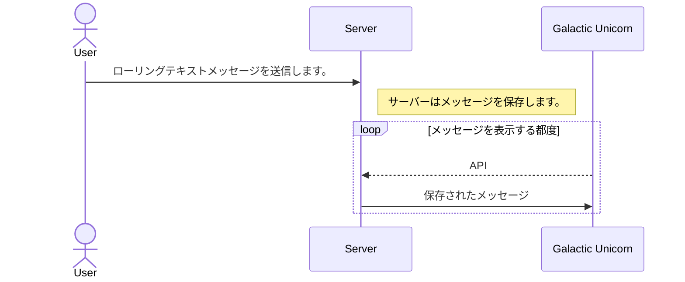

# Rolling Galactic

PIMORONI Galactic Unicornのテキストスクローラーです。すごいです。
https://shop.pimoroni.com/products/galactic-unicorn

WebサイトからGalactic Unicornを制御することがます。

このアプリは開発中であり、気が向いたときに機能を追加するかもしれません。

- [x] 複数のGalactic Unicornのサポート
- [ ] 新しいメッセージのためのサウンド再生
- [ ] フォントのサポート（Bitmap Distribution Format）


このアプリケーションはサーバー-クライアントのペアです。
このサーバーアプリケーションをRaspberry Pi 4またはほぼすべてのPython 3環境で実行できます。



このサーバーをローカルネットワークで実行すると、家のどこからでもGalactic Unicornにテキストを送信できます。家の外部（ローカルネットワーク外）からGalactic Unicornにアクセスする場合は、サーバーを公開可能にする必要があります。
私はこのサーバーを https://rolling.kotamorishita.com/ で実行しています。

*テスト目的*でこのサーバーを使用しても構いませんが、以下のことを念頭に置いてください。

- セキュリティには配慮していないため、機密情報を送信しないでください。
- 本番用に使用しないでください。
- いつでもこのサーバーをシャットダウン、変更、再起動、または完全に停止する可能性があります。

## Server setup

サーバーアプリケーションはPython 3とFlaskで書かれています。
1. Python 3とpip3をインストールします。（おそらくすでにインストールされていると思います）
2. 必要なパッケージをインストールします。
```
pip3 install -r server/requirements.txt
```
3. サーバーを実行します。
```
python3 server/server.py
```
4. ブラウザでアクセスします。 http://localhost:3999/ 
5. UUIDが生成されます。クリップボードにコピーするか、ブラウザを開いたままにしておきます。
6. クライアントをセットアップするために、サーバーのIPアドレスを確認してください。


## Galactic Unicornのセットアップ（クライアント）
最新のMicroPythonをダウンロードします。 https://github.com/pimoroni/pimoroni-pico/releases
2023年8月現在、最新のファームウェアはpimoroni-galactic_unicorn-v1.20.4-micropython.uf2です。

注:もし大きくバージョンが変更されている場合、このアプリは互換性がない場合があります。バージョン1.20.4を試してみてください。

### Flash latest MicroPython(Pimonori)
1. BOOTSELボタンを押しながらコンピューターに接続します。
2. PicoはRPI-RP2という名前のUSBマスストレージとしてマウントされます。
3. *pimoroni-galactic_unicorn-v1.20.4-micropython.uf2*をRPI-RP2にコピーします。Picoが再起動します。


### Galactic Unicornにファイルをコピーする
開発環境であるThonnyをダウンロードしてください。https://thonny.org/
1 Thonny IDEを開き、Picoに接続します。インタプリターとしてMicroPython（Raspberry Pi Pico）を選択する必要があります。
2. ローカルにクローンされたリポジトリに移動します。
3. WIFI_CONFIG.pyを編集して、WiFiのSSID、パスワード、および国コードを設定します。日本の場合はJPです。
4. main.pyでUUIDとGALACTIC_SERVERを更新します。

```python
UUID = '692a216f-967b-49ec-95f5-ef307982c4b0'
```
サーバーのIPが192.168.0.122の場合、以下のようにGALACTIC_SERVERを設定します。
URLの末尾に/api/を追加し、スキーム（httpまたはhttps）が必要です。
```python
GALACTIC_SEVER = 'http://192.168.0.122:3999/api/'
```

5. main.py、network_manager.py、およびWIFI_CONFIG.pyをPicoにアップロードします。
6. Picoのリセットボタンを押すと再起動し、 READY. と表示されるはずです。


# Credit
Pico側のコードのほとんどはPIMORONIのサンプルからコピペにより作っています。
オリジナルのライセンステキストはcreditsディレクトリの下にあります。
https://github.com/pimoroni/pimoroni-pico
